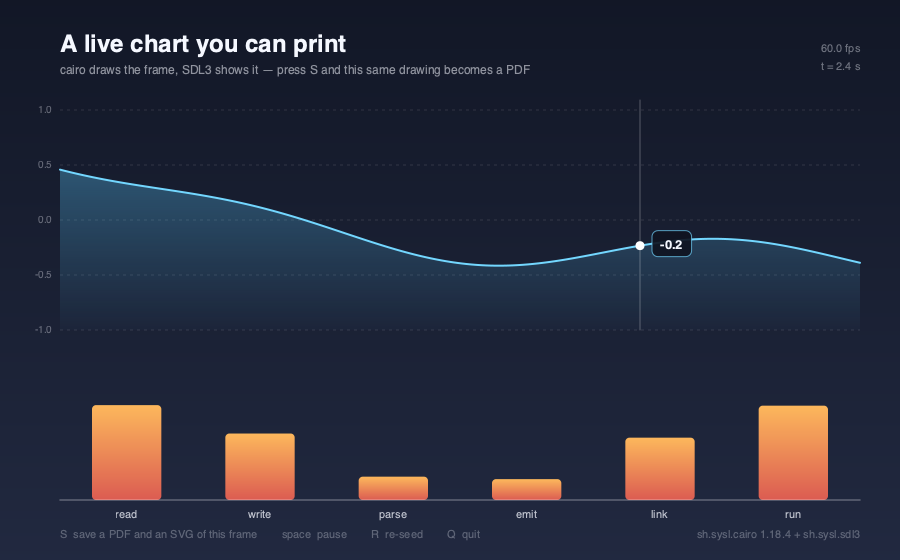

cairo-sdl3-demo
===============

A gear train tumbling in space — [**cairo**](https://github.com/sysl-lang/cairo) cuts the teeth,
[**sdl3**](https://github.com/sysl-lang/sdl3) turns the crank.



```
brew install cairo sdl3
sysl run . --link-path /opt/homebrew/lib --include-path cairo=/opt/homebrew/include/cairo
```

| key | what it does |
|---|---|
| `space` | stop the gears |
| `[` `]` | slower, faster |
| `T` | hold the tumble |
| `R` | re-cut the gears with different tooth counts |
| `Q` | quit |

Point at a gear to light it up.

It is a literate program
------------------------

The source is **`main.lsysl`**, and there is no `.sysl` beside it: the prose *is* the file, with the
program indented inside it. `sysl build` tangles it and `sysl doc` renders it —

```
sysl doc . -o gears.md
```

— re-fencing each indented block as ` ```sysl ` so a highlighter can read it, and passing the prose
through untouched, math and all. The projection is derived there properly rather than asserted in a
comment, which is the reason this program is written that way and the flat chart of an earlier draft
was not.

Why it takes two packages
-------------------------

**Neither library can do this alone.** SDL3 has a window, an event queue and a clock, and rasterizes
nothing but rectangles and textures. Cairo draws real vector graphics — gradients, arcs, measured
text, antialiasing — and has no idea what a window is.

The join is **one buffer of ARGB32 pixels**. That is cairo's native format and one of SDL's texture
formats, and on a little-endian machine both mean the bytes B, G, R, A — so nothing is converted
anywhere and there is no per-pixel loop in this program at all:

```sysl
draw(cr, m)                                              -- cairo rasterizes the frame
frame.flush()
tex.update(as_ptr(frame.data()), i32(frame.stride()))    -- straight into the texture
r.copy(tex)
r.present()
```

The 3D is real, not faked
-------------------------

Cairo is strictly 2D and its `Matrix` is affine: it rotates, scales and shears, and it cannot do
perspective. That sounds like it rules out a tumbling assembly, and it does not, because of one fact:

> **An orthographic projection of a *flat* object rotated in 3D is an affine map.**

A gear train is flat. So the tumble is not an approximation of a 3D rotation — it *is* one, computed
exactly and handed to cairo as six numbers. Cairo then foreshortens every circle into a true ellipse
and every tooth into its correct projection, for free, because that is what a transform means.

```sysl
projection(m: Model, z: real) -> Matrix
    val ct = m.yaw.cos()
    val st = m.yaw.sin()
    val cp = m.pitch.cos()
    val sp = m.pitch.sin()

    Matrix(ct, sp * st, 0.0, cp, SCREEN_X + z * st, SCREEN_Y - z * sp * ct)
```

The same inverse maps the mouse back into the gears' own plane, so pointing at a gear works under any
tumble — one matrix inversion rather than three transformed circles.

The thickness
-------------

The rim is the part a matrix cannot do, because a wall has corners at two different heights. So the
outline is built as a **polygon** — eight points to a tooth, three on each land and the flanks
straight — and every edge of it becomes a quad standing on the plane's normal.

Two things then have to be got right, and they are the difference between a solid and a mess:

- **Back-face culling.** A wall whose outward normal points away from the viewer is never drawn.
  Exactly half of them go, which is what lets the near face sit on top of a wall rather than inside a
  tube.
- **Order.** Depth around the outline is one cycle of a sinusoid, so the visible half is the arc
  centred on the nearest wall and its two *ends* are the far ones. Painting outwards-in from the
  nearest — the pair at distance `j`, then `j - 1`, and so on — puts every wall over the one behind
  it **without sorting anything**.

Each surviving wall is lit by its own normal, and so is the face. The light is fixed in *camera*
space rather than in the world's, so it does not tumble with the assembly: a face turning towards the
light brightens as it comes round, which is the cue that says "solid" more than the thickness itself
does.

The gears actually mesh
-----------------------

The first gear is placed by hand; the other two are placed by meshing, so there is nowhere for a
wrong distance to hide. Centres are `r1 + r2` apart, the driven gear turns the other way and slower
by the ratio of the tooth counts — and at the moment a tooth of the driver points along the line of
centres, a *gap* of the driven gear has to point back along it. That last half-tooth offset is the
one that decides whether the picture is of a machine or of two gears whose teeth pass through each
other.

The dashed pitch circles and the marked contact points are drawn because they are what the geometry
is actually about, and are invisible on a real gear. `R` re-cuts the train with different tooth
counts and everything follows: positions, speeds, the printed ratio.

Cost
----

About 40% of one core at 60 fps on an M-series Mac — roughly 400 shaded rim quads plus three faces
per frame, all software-rasterized by cairo. **RSS holds steady**, drifting a few MB either way
around 100 MB rather than climbing.

That used to be a thing to watch: every cairo object was released by hand, and one missed `destroy`
in a frame loop showed up as a one-way climb within seconds. Since cairo 0.2.0 there is no `destroy`
to miss — each object is a `&T` with an `impl Drop`, so a surface made inside the loop goes when the
iteration ends. The steady RSS is now a property of the binding rather than of this program's
discipline.

`--shot`
--------

```
sysl run . -- --shot
```

Draws one frame at a fixed angle under SDL's dummy video driver and writes `demo.png`. Every line of
the program still runs — only the display and the clock are stood in for — and the picture is the
same every time, because a frame is a pure function of one `Model`.

No files
--------

No font, no image, no data file. The gears are arithmetic, the typeface is whatever the system calls
`"sans"`, and the only file touched is the screenshot.

License
-------

[ISC](LICENSE)
